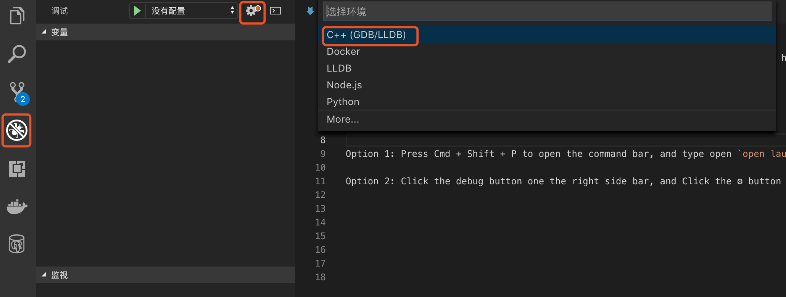
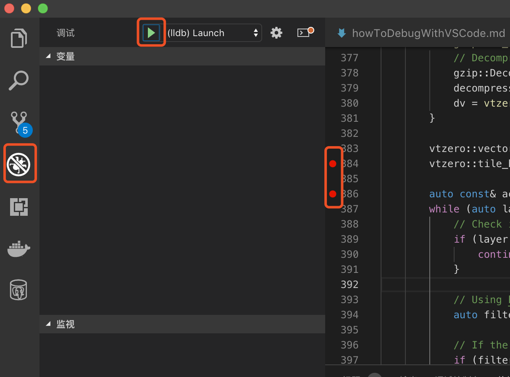
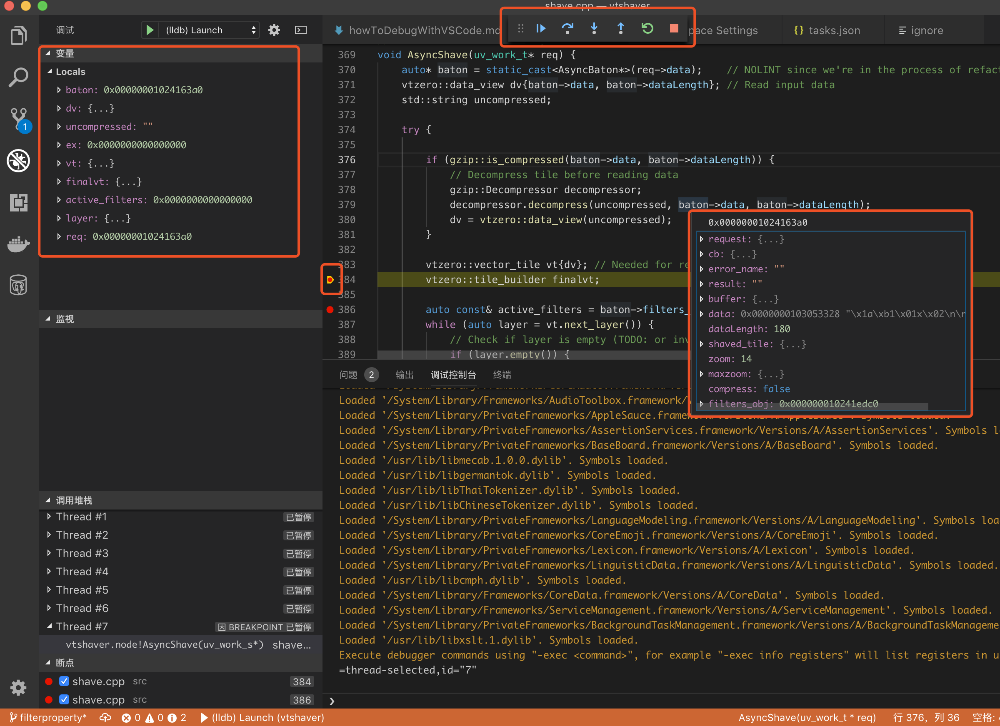

# How to debug C++ with VS Code

VS Code is a great source code editor for developing code in many languages. This document is to tell you how to debug a node C++ addon with VS Code.

### 1. Setting up VS Code debug

First open the node C++ addon folder in VS Code by choosing `File > Open`.

Then to start debugging there are two ways:

#### Option 1

Press `Cmd + Shift + P` to open the command bar, type open `open launch.json`, and then choose `C++`.

Note: the first time you do this you will need to `install` the C++ Extension and reload the app.

#### Option 2

Click the debug button on the right sidebar, click the `⚙` button on the right top, and then choose `C++`.



In the `launch.json` you can see some template, like this:

```json
{
    "version": "0.2.0",
    "configurations": [
        {
            "name": "(lldb) Launch",
            "type": "cppdbg",
            "request": "launch",
            "program": "enter program name, for example ${workspaceFolder}/a.out",
            "args": [],
            "stopAtEntry": false,
            "cwd": "${workspaceFolder}",
            "environment": [],
            "externalConsole": true,
            "MIMode": "lldb"
        }
    ]
}
```

`launch.json` defines which program you want to run after you click the run debug button. Let's say we want run `node test/vtshaver.test.js`. In this case we need to change the configurations, put `program` to node's absolute path (you can use `which node` to find the path of current version of node), and change the `args` to `${workspaceFolder}/test/vtshaver.test.js`.

Additional we want build C++ everytime before we start debug, so we add `preLaunchTask` into the config:

```
"preLaunchTask": "npm: build:dev",
```

Now the config file could look like this:


```json
{
    "version": "0.2.0",
    "configurations": [
        {
            "name": "(lldb) Launch",
            "type": "cppdbg",
            "request": "launch",
            "preLaunchTask": "npm: build:dev",
            "program": "/Users/mapbox-mofei/.nvm/versions/node/v8.11.3/bin/node",
            "args": ["${workspaceFolder}/test/vtshaver.test.js"],
            "stopAtEntry": false,
            "cwd": "${workspaceFolder}",
            "environment": [],
            "externalConsole": true,
            "MIMode": "lldb"
        }
    ]
}
```

Now you can open any C++ files and click the left side of the line number to add a breakpoint, then go to the debug button on the sidebar, click the run button on the top.



Now everything is done! Debug is Done! The program will stop at the breakpoint, you can use your mouse to explore the variable. If you want your program to continue past the breakpoint, you can navigate the program using the top control box.


